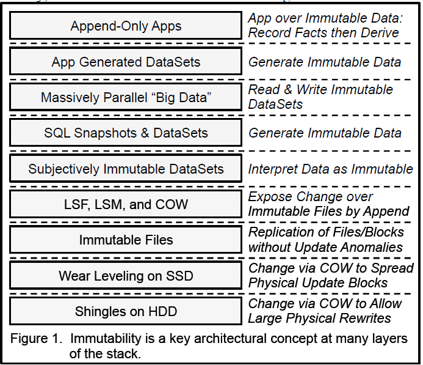
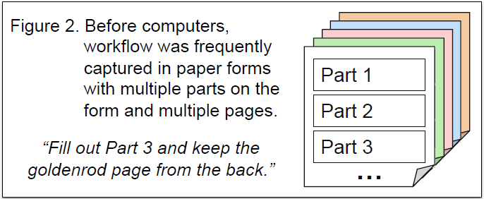
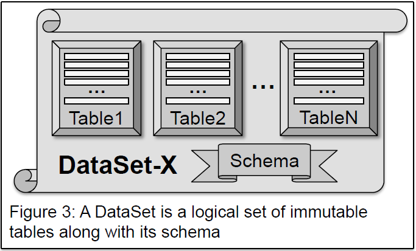
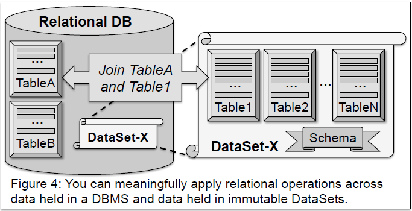
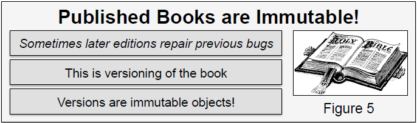
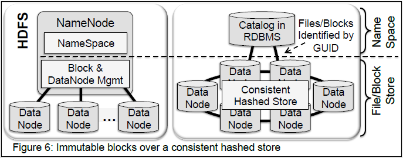

# 不变性改变一切

*Pat Helland*  
*Salesforce.com*  
*One Market Street, #300。*
*San Francisco, CA 94105 USA*
*01(415) 546-5881*
*phelland@salesforce.com*

 

## 摘要

存储和发送不可变数据已成为一种不可阻挡的趋势。我们需要<u>*不变性*</u>来进行远程协作，而且随着存储成本的降低，我们<u>*可以负担​​得起不变性*</u>。

本文仅仅是对利用不可变性的计算模式进行一次简单的探讨。在计算堆栈中反复探索，确实会让人产生似曾相识的感觉。

 

## 1. &emsp; 引言

不久之前，计算成本高昂，磁盘存储成本高昂，DRAM 成本高昂，但与锁存器的协调成本却很低。如今，这一切都随着低成本计算（多核）、低成本通用磁盘、低成本 DRAM 和 SSD 的出现而改变，而与锁存器的协调却变得更加困难，因为锁存器的延迟会错失大量的指令执行机会。

    

        我们现在有能力维护大量数据的不可变副本，而由此带来的一个好处就是协调难度的降低。
    

 

### 1.1 &emsp; 更多存储、分布和歧义

随着每TB磁盘成本的持续下降，我们的<u>*存储容量不断增加*</u>。这意味着我们可以长期保存大量数据。

随着越来越多的数据和工作分散在广阔的地域，我们的<u>*分布式程度不断提高*</u>。数据中心内的数据似乎“遥远”，多核芯片内的数据也可能显得“遥远”。

与远距离系统进行协调时，我们面临着<u>*日益增长的不确定性*</u>……自从你听到消息以来，又发生了更多的事情。你能在信息不完整的情况下采取行动吗？你能等待足够的信息吗？

 

### 1.2 &emsp; 层层嵌套 [17]

随着各技术领域的不断发展，为了应对存储、分发和模糊性日益增长的趋势，它们以各种有趣的方式利用了不可变数据。我们将探讨应用程序如何在日常工作中利用不可变性，如何生成不可变数据集以供后续离线分析，SQL 如何公开和处理不可变快照，以及大规模并行“大数据”工作如何依赖于不可变数据集。这引导我们研究语义上不可变的数据集如何在保持其不可变性的同时进行修改。

接下来，我们将探讨如何通过诸如 LSF（日志结构文件系统）、COW（写时复制）和 LSM（日志结构合并树）等技术，在创建新的不可变文件之上实现可更新性。我们将研究复制和分布式文件系统如何依赖不可变性来消除异常。

最后，我们将讨论硬件开发人员如何通过在 SSD 和 HDD 中运用这些技巧来加入这一行列。参见图 1。最后，我们来看一下使用不可变数据的一些权衡取舍。

 

## 2. &emsp; 会计师不用橡皮擦

许多计算任务都可以被描述为“仅追加式”。本节将探讨一些实现这种特性的常用方法。

 

### 2.1 &emsp; “仅追加”计算

许多计算类型都是“仅追加式”的。观测结果会被永久记录（或长期保存）。衍生结果按需计算（或定期预先计算）。

这类似于数据库管理系统。事务日志记录对数据库所做的所有更改。高速追加是修改日志的唯一方法。从这个角度来看，数据库的内容缓存了日志中最新的记录值。事实上，日志就是真相。数据库是日志子集的缓存。这个缓存的子集恰好包含了日志中每条记录和索引值的最新值。

 

### 2.2 &emsp; 统计：观察事实与衍生事实

<u>*会计人员不用橡皮擦*</u>，否则就要坐牢。账簿上的所有条目都必须保留在账簿中。可以进行更正，但只能通过在账簿中添加新条目来实现。公司发布季度业绩时，会包含对上一季度业绩的小幅更正。小幅更正没问题！而且也只能追加到账簿上！

有些条目描述的是<u>观察到的事实</u>。例如，支票账户的借方或贷方收款就是一个观察到的事实。

有些条目描述的是<u>推导的事实</u>。基于这些观察结果，我们可以计算出新的内容。例如，根据利率和成本计算摊销的资本支出。另一个例子是应用了借方和贷方的当前银行账户余额。

 

### 2.3 &emsp; 仅追加分布式单主数据库

单主计算意味着我们需要以某种方式对变更进行排序。这种排序可以来自集中式主节点，也可以来自类似 Paxos [11] 的分布式协议，该协议提供串行排序。我们以某种方式语义化地逐一应用变更。

变更会覆盖​​其先前的变更。新值会取代旧值。这种粒度可以是关系存储中的一组记录，也可以是文档的新版本。

分布式单主计算意味着存在一个数据空间（关系记录、文档、导出文件等），该空间从一个逻辑位置发出，并随着时间的推移产生新版本。

 

### 2.4 &emsp; 分布式计算的“过去”

在电话出现之前，人们使用信使。这些信使通常是孩子们，他们穿梭于城镇之间传递信息。或者，也可以通过邮政服务递送信息。但这种方式耗时很长……

有时，人们会使用精美的表格来记录计算过程。这些表格有多层，每一层都用不同的颜色书写。表格页面上有多个部分。参与者填写下一部分（用力按压笔尖）。然后，他撕下表格的最后一页并归档。每个参与者都能获得所需的数据，并向表格中添加更多数据。你无法更新前面的部分，只能将数据追加到表格末尾。参见图 2。

分布式计算是只读的！新的信息，表格中的新内容……每一项都是一个版本，而且每一项都是不可更改的。你永远不允许覆盖已经写入的内容。

 

## 3. &emsp; 外部数据与内部数据

令人惊讶的是（对于我们这些数据库老手来说），并非所有数据都保存在关系数据库系统中。本节将探讨数据解锁的一些影响。本节是[7]的子集。

 

### 3.1 &emsp; 内部数据

内部数据指的是由经典关系数据库系统及其相关应用程序代码维护和管理的内容。有时，它也被称为服务。

内部数据存在于一个事务环境中，其变更以可序列化的方式（或类似方式）进行应用。

 

### 3.2 &emsp; 外部数据

外部数据以消息、文件、文档和/或网页的形式呈现。这些数据通过服务发送到外部世界。此外，外部数据也可能并非通过数据库创建，而是通过其他机制生成的。

**外部数据：**
- <u>**不可变：**</u>一旦写入，便无法更改。
- <u>**已解锁：**</u>数据并未锁定在数据库中。系统会提取副本并将其发送到外部。
- <u>**具有唯一标识：**</u>发送到外部时，这些文件、文档和消息都具有唯一标识（例如 URL）。
- <u>**可能带有版本控制：**</u>更新并非真正的更新，而是具有新唯一标识符的新版本。

 

### 3.3 &emsp; 内部与外部的对比

内部数据和外部数据在表示方式、含义和使用方式上存在着深刻的差异。我们越来越多地将数据作为外部（不可变）数据保存。

|  | 内部数据 | 外部数据 |
|:-:|:-:|:-:|
| 可变 | 是！ | 否！ 不可变 |
| 粒度 | 关系字段 | 文档、文件或消息 |
| 表示形式 | 通常为关系型 | 通常为半结构化 |
| 模式 | 规范型 | 描述型 |
| 标识 | 无标识：按值传递数据 | 标识：URL、消息编号、文档 ID |
| 版本控制 | 无版本控制：按值传递数据 | 版本控制可以增强标识 |

 

## 4. &emsp; 引用不可变数据

本节介绍<u>*数据集（DataSet）*</u>，它指的是具有唯一ID的数据集合。有些数据集的结构类似于具有特定模式的多个表。我们将探讨关系数据库如何引用这些数据集，以及关系运算符如何跨越数据库管理系统（DBMS）和数据集。

 

### 4.1 &emsp; 数据集：不可变的数据集合

我们将<u>**数据集**</u>定义为一组固定且不可变的表。数据集中包含每个表的模式。数据集创建时，会捕获每个表的内容。由于数据集是不可变的，因此它创建后，可供读取，然后即被删除。数据集可以是关系型的，也可以是其他表示形式，例如图、层次结构（例如 JSON）或其他任何表示形式。参见图 3。

 

### 4.2 &emsp; 关系数据库引用的数据集

关系型数据库管理系统 (DBMS) 可以引用数据集。DBMS 可以访问数据集的元数据。即使数据未更新，也可以读取数据。即使数据集实际存储在其他位置，它在关系系统中仍然具有语义上的意义。由于数据集是不可变的，因此无需锁定，也无需担心更新控制的问题。

 

### 4.3 &emsp; 关系数据库对不可变数据集的处理

函数式计算接受一组输入，并按预期生成一组输出。这可以发生在对关系数据库中锁定或快照数据的查询中，也可以发生在“大数据”MapReduce 系统中。在这两种情况下，都存在一个静止不变的数据集合。<u>*当使用快照或某种隔离机制时，数据库数据在计算期间语义上是不可变的。*</u>对于“大数据”计算，输入通常存储在 GFS 或 HDFS 文件中。

在关系数据库内部存储的数据和外部数据集中存储的数据之间执行 JOIN 操作不存在语义障碍。锁定（或快照隔离）提供了一个关系数据库的版本，该版本可以进行连接。命名且冻结的数据集可以与关系数据进行连接。参见图 4。

在某些方面，能够跨不可变数据集和关系数据库进行操作令人惊讶。不可变数据集由标识和一个可选的版本定义。它们的模式描述了数据集创建时的形状和形式。它采用的是描述性模式，而非关系数据库管理系统（RDBMS）中规范性模式。

这种模式的调整旨在将两者融合，从而将数据集的模式（描述其写入时的数据）与关系数据库管理系统的模式（描述其快照时的数据）连接起来。

此外，连接（JOIN）和其他关系运算符必须将数据集的内容组合起来，这些内容<u>*被解释为一组关系表*</u>。这绕过了数据集内部的身份标识概念，而完全专注于表本身，即表被解释为一组包含在行和列中的值。

 

## 5. &emsp; 不变性取决于观察者的视角

在本节中，我们将讨论消费者可能认为数据集是不可变的，即使它们在底层发生了变化。

 

### 5.1 &emsp; 数据集在语义上是不可变的

数据集在语义上是不可变的。它包含一组表、行和列。它还可以包含半结构化数据（例如 JSON）。它还可以包含采用专有格式的应用程序特定数据。

数据集可以定义为对先前存在的数据集执行 SELECTION、PROJECTION 或 JOIN 操作的结果。从语义上讲，所有先前的数据现在都成为新数据集的一部分。

    

        <i><b>对于数据集来说，重要的是从读者的角度来看，它似乎是不变的。</b></i>
    

 

### 5.2 &emsp; 针对读取模式优化数据集

数据集在语义上是不可变的，但物理上可以更改。您可以添加一两个索引。为了优化读取访问，对表进行非规范化是可以接受的。数据集可以进行分区，并将分区放置在靠近读取器的位置。对数据集进行面向列的表示也可能很有意义！

您可以创建一个列数少得多的表副本，以优化快速访问（瘦表）。可以将列值保留在两个地方，即瘦表和胖表。

通过观察和监控数据集的读取使用情况，您可能会发现新的优化方法（例如，创建新索引）。

 

### 5.3 &emsp; 不可变性与“大数据”

大规模并行计算基于不可变输入和函数式计算。MapReduce [3] 和 Dryad [9] 都以不可变文件作为输入。计算任务被分割成多个部分，每个部分都使用不可变输入。这种函数式计算（使用不可变输入）是幂等的。即使计算失败并重新启动也是可以接受的。

    <h4 align="center"><u>不可变性是“大数据”的基石</u></h4>
    

        <i>使用不可变输入的函数式计算 失败和重新启动基于函数式计算在不可变输入上的幂等性
        </i>
    

 

### 5.4 &emsp; 作为语义棱镜的不可变性

数据集展现出一种不可变的语义棱镜，即使底层表示被扩展或完全替换。

《钦定版圣经》的语义是逐字不变的；即使它使用不同的字体印刷；即使它被数字化；即使它配有不同的图片……嗯……

如果数据集被无损地转换为新的模式表示，它是否会被改变？如果新的地址字段容量更大，这可以吗？如果枚举值被映射到新的底层表示，这可以吗？我们可以将数据从 UTF-8 编码映射到 UTF-16 编码吗？

    <h4 align="center">光有正确的部分还不够！</h4>
    

        <i>你还得知道如何解读它们……</i> “布什总统”在1990年和2005年的含义截然不同。 “Fanny”这个词在美国和澳大利亚的用法不一样。 <i>你需要知道这些不可更改的部分到底是什么意思！</i>
        </i>
    

 

### 5.5 &emsp; 描述性元数据不可变性

我们大多数人都习惯于 SQL DDL 支持表元数据的动态更改。这种更改发生在事务边界，可以为现有数据指定新的模式。

创建不可变数据集时，数据的语义不能更改。我们所能做的只是描述数据集创建时的内容。

SQL DDL 可以被视为<u>*规范性元数据*</u>，因为它规定了表示形式（这种表示形式可能会改变）。不可变数据集具有<u>*描述性元数据*</u>，用于解释数据集的内容。

当然，您可以创建引用一个或多个其他现有数据集的新数据集，以创建其数据的新表示形式。每个新数据集都有其唯一的 ID。

使用引用而不是值来实现数据集并没有什么问题。

 

### 5.6 &emsp; 规范化是小儿科

规范化的目标是消除更新异常。如果数据没有以规范化的方式存储，更新操作可能会产生不良后果。一个典型的例子是，一个规范化不完善的表，其中每个员工都包含其经理的姓名和电话号码。由于经理的电话号码存储在多个位置，因此更新起来非常困难。对于设计用于更新的数据库而言，规范化至关重要。

<u>*对于不可变数据集，规范化并非必要。*</u>

规范化不可变数据集的唯一原因可能是为了减少其所需的存储空间。另一方面，非规范化的数据集作为计算的输入可能更容易处理，速度也更快。

 

## 6. &emsp; 嘿！版本也是不可更改的！

在本节中，我们将探讨版本的使用，每个版本都是不可变的。首先，我们将了解多版本并发控制。然后，我们将了解诸如日志结构合并树 (LSM) 之类的技术如何在事务空间中提供变更语义，同时生成描述这些变更状态的不可变数据。最后，我们将从写时复制 (copy-on-write) 的角度来探索，在这种机制中，高性能更新是通过写入新的不可变数据来实现的。

 

### 6.1 &emsp; 版本与历史

除了第一个版本之外，新版本通常用于替换或扩展之前的版本。

<u>*线性版本历史*</u>有时被称为强一致性。一个版本会替换另一个版本。每个版本都有一个父版本和一个子版本。每个版本都是不可变的。每个版本都有一个标识。通常，每个版本都被视为对早期版本的替换。

或者，版本历史也可以是 DAG（有向无环图）或<u>*版本历史的有向无环图*</u>。在 DAG 中，可以有多个父版本和/或多个子版本。这有时被称为最终一致性。

    

        <i><b>版本号是不可变的，并且应该具有不可变的名称。</b></i>
    

 

### 6.2 &emsp; 多版本并发控制

强一致性（ACID）事务看起来像是按顺序执行的。这有时被称为可串行化 [2]。

    <h4 align="center">数据库会随着版本更新而变化。</h4>
    

        事务 T1 是一个版本。之后，事务 T2 也是一个版本。 所有可更改的内容都可以理解为一系列版本。
    

事务将记录和索引更改的新版本叠加在先前版本之上。新版本可以作为整个数据库的快照进行捕获（尽管这样做性能不太好）。

或者，您可以将新版本捕获为对先前版本的更改。您可以以这种方式构建键值存储。您可以在键值存储之上构建关系数据库。记录通过添加墓碑标记来删除。

<u>*向键值存储添加新值会更改数据库。*</u>

如果为每个新版本添加时间戳，则可以显示数据库在特定时间点的状态。这允许用户导航到数据库的任何旧版本。正在进行的工作可以看到数据库版本的稳定快照。

 

### 6.3 &emsp; LSM：重组不可变数据

使用 LSM（日志结构合并树）[15]，对键值存储的更改是通过写入受影响记录的新版本来实现的。这些新版本会被记录到一个不可变文件中。这些键值的新版本会定期按键排序，并写入到 LSM 树中称为 Level-0 文件的不可变文件中。Level-0 文件会被合并成 Level-1 文件集合（通常是 10 个 Level-1 文件，每个文件包含键范围的十分之一）。类似地，Level-1 LSM 文件会以 10:1 的比例与 Level-2 LSM 文件合并。随着 LSM 树向下移动，每一层的文件数量都会增加 10 倍。读取一条记录通常需要搜索每一层的一个文件。

在合并 LSM 文件的过程中，我们会读取不可变文件，并写入具有新标识的全新不可变文件。

    

        <b>LSM 在不可变文件之上呈现出变化的表象。</b>
    

 

### 6.4 &emsp; 尽情发挥吧！

LSM 如何将不可变文件转换为可变数据？本质上，它执行写时复制 (COW)。复制的粒度通常是键值对。对于关系数据库，这可以是每个记录或每个索引条目的键值对。更改会被复制到日志中，然后复制到 LSM 树中（合并时还会复制几次）。

高性能的写时复制结合了日志记录和传统的数据库管理系统 (DBMS) 性能优化技术。新版本会被捕获到内存中并记录下来，以便进行故障恢复。每个日志文件都有一个唯一的 ID，并且日志文件是不可变的。每个新的日志文件都可以记录其先前日志文件的历史记录，甚至可以记录后续日志文件的 ID。如果您拥有最近的日志文件 ID，就可以重建整个 LSM 键值存储。

    

        除了将日志的起始点保存在某个地方之外，描述数据库状态的所有信息都可以保存在不可变文件中。
    

 

## 7. &emsp; 妥善保管石碑

许多文件系统都保存着由不可变数据块组成的不可变文件。本节将从宏观层面探讨 GFS 和 HDFS 的实现，以及这些文件可能带来的各种应用。我们将讨论可重命名文件的特殊性。最后，我们将探讨在一致性哈希存储中存储不可变数据的价值。

 

### 7.1 &emsp; 日志结构化文件：原地打转！

日志结构文件系统 (LSFS) [16] 是利用不可变性实现变更的早期范例。在这个精妙的发明中，文件系统的写入操作总是追加到一个循环缓冲区的末尾。偶尔，会向循环缓冲区添加足够的元数据来重建文件系统。旧数据必须向前复制，以免被覆盖。

日志结构文件系统具有一些非常有趣的性能特性，既有优点也有缺点。如今，它是一项重要的技术。随着技术发展趋势朝着近年来的方向演进，它的重要性将会更加凸显。

 

### 7.2 &emsp; 文件、块与复制

GFS [5]、HDFS [1] 等文件系统提供高可用性文件。每个文件由若干数据块（或块）组成。文件包含文件名和数据块描述，用于提供字节流。每个数据块（在 GFS 中称为“块”）都会在集群中进行复制，以确保持久性和高可用性。通常情况下，它们会在数据中心的不同故障区域进行三次复制。

每个文件都是不可变的，并且（通常）是单写操作。文件创建后，一个进程可以向其中追加数据。文件会存在一段时间，最终会被删除。多写操作比较困难，GFS 在这方面也遇到了一些挑战，如 [13] 中所述。

不可变的文件和不可变的数据块赋予了这种复制能力。文件系统没有“整个文件被更改”的概念。每个数据块的不可变性使其能够轻松复制而不会出现任何更新异常，因为它不会被更新！

    <h4 align="center">不可篡改数据块的高可用性现已实现！</h4>
    

        <i>谷歌、亚马逊、Facebook、雅虎、微软等公司都存储着PB级甚至EB级的不可篡改数据！</i>
    

 

### 7.3 &emsp; 广泛共享不可变文件是安全的

不可变文件具有身份和内容。

*<h5>身份和内容都不能更改！</h5>*

您可以随时随地复制不可变文件。您可以将不可变副本共享给其他用户。只要您管理好引用计数（以便知道何时可以删除文件），就可以使用一份文件副本供多个用户共享。您可以将不可变文件分发到任何您想要的地方。由于具有相同的身份和相同的内容，这些文件与位置无关！参见图 5。

 

### 7.4 &emsp; 名称与不可变性……一条危险的滑坡

GFS（Google 文件系统）和 HDFS（Hadoop 分布式文件系统）提供不可变文件。不可变的数据块（块）会在<u>*数据节点*</u>之间进行复制。不可变文件是由一系列数据块（块）组成的，每个数据块都由一个 GUID 标识。文件的内容是不可变的，并由一个 GUID 标记。文件 ID GUID 始终指向唯一一个文件及其内容。

GFS 和 HDFS 还提供了一个可以更改的命名空间！不可变文件的逻辑名称可以更改为其他名称。文件名可以绑定到不同的内容。用户在更改文件名时必须格外小心，以确保结果可预测。<u>*如果文件名可以更改，它还能算是不可变的吗？*</u>名称究竟是什么？

 

### 7.5 &emsp; 不可变数据与一致性哈希

考虑一个强一致性文件系统。该系统由一个主节点控制一个命名空间（例如 POSIX 风格的命名空间）。查找文件会返回一个 GUID，该 GUID 用于查找一个不可变的字节流。

我们考虑一个使用一致性哈希 [10] 实现的存储。众所周知，一致性哈希在发生故障和/或需要额外容量时能够提供非常强大的重新平衡机制。然而，当环路调整以适应变化时，其放置行为会略显混乱。有时，一些参与者已经看到了变化，而另一些参与者则没有。在一致性哈希键值存储中进行读取和更新时，读取操作偶尔会返回旧版本的值。为了应对这种情况，应用程序必须设计成最终一致性 [4]，但这会增加负担，并提高应用程序的开发难度。

    

        <i>当在一致性哈希环中存储不可变数据时，您不会获得数据的过时版本。存储的每个区块都只有它唯一的版本！</i>
    

这种方法既能提供自管理且无主节点的文件存储的优势，又能避免应用程序所面临的最终一致性异常和挑战。参见图 6。

使用最终一致性存储来保存不可变数据，意味着日志写入可以拥有更可预测的服务级别协议 (SLA)，因为副本可以写入集群中不太容易预测的位置。在分布式集群中，您可以知道写入<u>*位置*</u>，也可以知道写入<u>*何时*</u>完成，但无法同时知道两者 [8]。通过预先从强一致性目录中分配文件，使用文件 ID 的日志写入只需访问弱一致性服务器，并且可以重试以在限定时间内使数据块持久化。

 

### 7.6 &emsp; 不可变性与去中心化恢复

通过将命名空间与块放置控制分离，可以带来诸多优势。一致性哈希环即使在环结构不稳定的情况下也能承受读写操作。

虽然目录是访问的中心点，但它不像名称节点那样能够灵活应对集群故障。集群规模越大，发生故障的数据节点就越多，每次故障都需要执行大量的控制操作才能将副本数恢复到三个。在这种流量波动期间，集群的读写操作将会出现服务级别协议 (SLA) 波动。

    

        <i>不可变性使得数据节点故障的去中心化恢复成为可能，并能提供更可预测的服务级别协议 (SLA)。</i>
    

 

## 8. &emsp; 硬件变化趋于不变

在新的设计中利用不可变性已成为一种普遍趋势，我们在许多硬件领域都能看到它的身影。我们首先探讨固态硬盘 (SSD) 的实现，然后介绍硬盘的一些新趋势。

 

### 8.1 &emsp; SSD 与损耗均衡

大多数固态硬盘 (SSD) 中的闪存芯片被分割成多个物理块，每个物理块的写入次数有限，超过一定次数后就会开始损耗，导致数据可靠性下降。因此，芯片设计者引入了一种称为损耗均衡 [12] 的功能来缓解闪存的这一问题。

闪存芯片逻辑地址空间中的每个新块或对现有块的更新都会映射到不同的物理块。每次写入（或对新块的更新）都会以循环的方式写入不同的物理块，从而使每个物理块的写入次数大致相同。

损耗均衡是一种写时复制 (copy-on-write) 技术，它将块的每个版本都视为不可变版本。

 

### 8.2 &emsp; 硬盘：磨损严重

随着硬盘制造商不断努力提高磁盘数据面密度，一些物理难题也随之而来。目前的磁盘设计中，写入磁道远大于读取磁道。写入操作会像在屋顶上铺设瓦片一样，与之前的写入操作相互重叠。因此，这种设计被称为 *“叠瓦式磁盘系统”* [6]。

在叠瓦式磁盘中，有一大片数据以层叠写入磁道的形式写入，形成瓦片状结构，部分覆盖之前的磁道。如果要覆盖数据带中间部分的数据，就会破坏数据带的其余部分。

为了解决这个问题，硬件磁盘控制器在磁盘控制器内部实现了日志结构文件系统[14]。操作系统并不知道叠瓦式磁盘的使用。写入磁盘的数据（即以叠瓦式写入的数据带）在被丢弃之前保持不变。磁盘的用户（例如操作系统）则能够感知到数据就地更新的能力。

 

## 9. &emsp; 不变性也可能存在一些阴暗面

当我们以各种方式利用不可变性时，需要权衡利弊。我们发现，非规范化文档有助于提升读取性能，但会增加存储成本。使用写时复制时，数据会被多次复制。当我们叠加这些机制时，这种情况会更加严重。

 

### 9.1 &emsp; 非规范化：灵活但臃肿

反规范化会消耗存储空间，因为数据项会在数据集中被多次复制。它的优点在于可以避免使用 JOIN 操作来合并数据，从而提高数据利用效率。

不可变数据在表示方式上提供了更多选择。我们可以进行规范化以优化空间占用，也可以进行反规范化以提升读取效率。

 

### 9.2 &emsp; 写入放大与读取损耗

当我们使用写时复制（例如，日志结构文件系统、日志结构合并系统、固态硬盘的损耗均衡以及机械硬盘的叠瓦式管理）时，数据可能会被多次复制。这被称为写放大[18]。

在许多情况下，写放大的程度与读取所管理数据的难度之间存在关联。例如，一些日志结构合并树（LSM）系统会随着数据的重组和合并而进行或多或少的复制。如果数据被积极地合并和重组，那么读取记录时需要检查的位置就会减少。这可以降低读取成本，但会增加写入成本。

 

## 10. &emsp; 结论

设计正朝着不可变性发展。我们需要不可变性来协调日益远距离的数据。只要有足够的空间长期存储数据，我们就能负担得起不可变性。版本控制让我们能够了解数据的变化，而底层数据则以绑定到唯一标识符的新内容来表示。

<u>**写时复制 (Copy-on-Write)：**</u>许多新兴系统利用写时复制语义，在将不可变文件写入底层存储的同时，提供变更的表象。反过来，由于底层存储存储的是不可变文件，因此它提供了健壮性和可扩展性。例如，许多键值系统都使用日志结构的合并树来实现（例如 HBase、BigTable 和 LevelDB）。

<u>**干净的复制：**</u>当数据不可变且具有唯一标识符时，许多复制方面的挑战都会得到缓解。由于不存在过时的版本，因此无需担心找到过时的数据版本。因此，复制系统可以更加灵活，对副本的部署位置要求也更低。复制错误也会更少。

<u>**不可变数据集：**</u>不可变数据集可以通过引用与事务数据库数据结合，并在数据集映射关系模式和表时提供清晰的语义。我们可以查看不可变数据集映射的语义，并创建一个针对不同使用模式优化但语义不变的新版本。映射、冗余复制、反规范化、索引和列式存储都是在保持语义不变的情况下优化不可变数据的示例。

<u>**并行性和容错性：**</u>不可变性和函数式计算是实现“大数据”的关键。

    <h4 style='margin:0.5em;' align="center">
        <i><b>不变性改变了一切！</b></i>
    </h4>

 

## 11. &emsp; 参考文献

[1] &emsp; &emsp; http://en.wikipedia.org/wiki/Apache_Hadoop

[2] &emsp; &emsp; Bernstein, P.; Hadzilacos, V.; Goodman, N. (1987). “Concurrency Control and Recovery in Database Systems”, *Addison Wesley, ISBN 0-201-10715-5*.

[3] &emsp; &emsp; Dean, J.; Ghemawat, S. (2004). “MapReduce; Simplified Data Processing on Large Clusters”. OSDI ’04: 6th Symposium on Operating System Design & Implementation.

[4] &emsp; &emsp; DeCandia, G.; Hastorun, D.; Jampani, M.; Kakulapati, G. Lakshman, A.; Pilchin, A.; Sivasubramanian, S.; Vosshall, P. Vogels, W. (2007). “Dynamo: Amazon’s Highly Available Key-Value Store”. *Proc of the 21st ACM Symp on Operating Systems Principles*.

[5] &emsp; &emsp; Ghemawat, S.; Gobioff, H.; Leung, S. (2003) “The Google File System”. *Proceeedings of the 19th ACM Symposium on Operating Systems Principles – SOSP ‘03*

[6] &emsp; &emsp; Gibson, G.; Ganger, G. (2011) “Principles of Operation for Shingled Disk Devices”. *Carnegie Mellon University Parallel Data Lab Technical Report CMU-PDL-11-107*.

[7] &emsp; &emsp; Helland, P. (2005) “Data on the Outside versus Data on the Inside” *Proceedings of the 2005 CIDR Conference (Conference on Innovative Database Research)*.

[8] &emsp; &emsp; Helland, P. (2014) “Heisenberg Was on the Write Track”. *Abstract: Proceedings of the 2015 CIDR Conference (Conference on Innovative Database Research)*.

[9] &emsp; &emsp; Isard, M.; Budiu, M.; Yu, Y.; Birrell, A.; Fetterly, D. (2007) “Dryad: Distributed Data-Parallel Programs from Sequential Building Blocks” *European Conf on Computer Systems (EuroSys)*.

[10] &emsp; &emsp; Karger, D.; Lehman, E.; Leighton, T.; Panigraphy, R.; Levine, M.; Lewin, D. (1997). “Consistent Hashing and Random Trees: Distributed Caching Protocols for Relieving Hot Spots on the World Wide Web”. *Proc. of the 29th Annual ACM Symp on Theory of Computing*.

[11] &emsp; &emsp; Lamport, L. (1998). “The Part-Time Parliament”, *ACM Transactions on Computer Systems (TOCS), Volume 16, Issue 2, May 1998*.

[12] &emsp; &emsp; Lofgren, K.; Normal, R.; Thelin, G.; Gupta, A.; (2003). “Wear leveling techniques for flash EEPROM systems”. *US Patent # 6850443 (SanDisk, Western Digital)*.

[13] &emsp; &emsp; McKusick, M.; Quinlan, S.; “GFS: Evolution on Fast Forward” (2009) ACM Queue, August 7, 2009.

[14] &emsp; &emsp; New, R.; Williams, M.; (2003). “Log-structured file system for disk drives with shingled writing”. *US Patent # 7996645 (Hitachi)*.

[15] &emsp; &emsp; O’Neil, P; Cheng, E.; Gawlick, D.; O’Neil, E. (1996) “The Log-Structured Merge-Tree (LSM-tree)”. *Acta Informatica 33 (4)*.

[16] &emsp; &emsp; Rosenblum, M.; Ousterhout, J. (1992) “The Design and Implementation of a Log-Structured File System”. *ACM Transactions on Computer Systems, Vol. 10, Issue 1*.

[17] &emsp; &emsp; http://en.wikipedia.org/wiki/Turtles_all_the_way_down

[18] &emsp; &emsp; http://en.wikipedia.org/wiki/Write_amplification

