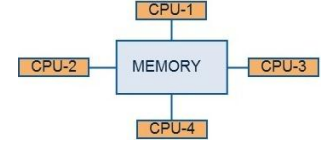
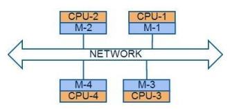

# 通过并行编程范式及其原理迈向高性能计算 (HPC)

Dr. Brijender Kahanwal

Department of Computer Science & Engineering, Galaxy Global Group of Institutions, Dinarpur, Ambala, Haryana, India

 

## *摘要*

*如今，我们需要快速找到解决庞大计算问题的方法。这催生了并行计算的概念，即多台机器或处理器协同工作以完成计算任务。在过去的几十年里，人们对并行计算在计算机器中的重要性有着诸多不同的认识。人们观察到，并行计算是解决许多计算限制（例如速度和密度、非重复性和高成本、以及功耗和散热等）的优越方案。商用多处理器的价格已经低于大型机和超级计算机。本文将探讨基于并行编程范式（PPP）的高性能计算（HPC）及其结构和设计方法。*

 

## *关键词*

*并行编程语言、并行编程结构、分布式计算、高性能计算*

 

## 1. &emsp; 引言

计算机科学中众多计算密集型任务，例如天气预报、气候研究、油气勘探、分子建模、量子力学和物理模拟，通常由超级计算机和大型计算机完成。但如今，随着技术的进步，多处理器系统或多核处理器系统将逐渐取代超级计算机，承担起执行此类计算的任务。

由于硬件技术的最新进展，我们正在摒弃冯·诺依曼计算模型，转而采用分布式计算模型，其中包括点对点 (P2P)、集群、云计算、网格计算和丛林计算模型[1]。所有这些模型都用于实现并行性，并且都是高性能计算 (HPC) 模型。

*并发性和并行性：* 首先，我们必须明确并发性和并行性这两个概念。我们可以借助线程（轻量级进程）来更好地解释它们。当两个或多个线程同时处于执行过程中时，实际上它们可能并非同时执行，但它们都处于执行过程中。

这被称为并发[25]。这些线程可能在单处理器或多处理器机器上执行，也可能不执行。当两个或多个线程实际上同时在不同的CPU上运行时，这被称为并行[25]。为了实现并行，我们通常至少需要两个CPU，它们可以位于单台机器（多处理器机器）或多台机器上。并行事件也可以称为并发事件，但反之则不然。集合论很好地描述了并行⊂并发（并行包含于并发中），如图1所示。

/image1.png)  
图 1：并发是并行性的超集

在冯·诺依曼计算机器上，程序是一个单一的执行序列。但单个程序中可能包含多个可以同时执行的子程序。这些程序被称为顺序程序，是因为子程序的执行是按照预定的顺序进行的。一般来说，程序被称为并发程序或并行程序，其中子程序可以并发执行，这些子程序被称为任务[2]。

如今，计算机并发执行多个程序已成为一种常见的做法。它可以采用多处理器（多个CPU）架构，这些处理器共享公共内存空间，如图2(a)所示；也可以采用多处理器架构，这些处理器拥有独立的内存或分布式内存，如图2(b)所示。

<table>
    <tr>
        <td>
             
            
<b>(a)</b>
 
            
图 2（a）：共享架构。

        </td>
        <td>
             
            
<b>(b)</b>
 
            
图 2（b）：分布式架构。

        </td>
    </tr>
</table>

如何高效、有效地利用这些硬件技术，并使这些处理器协同工作，是科学家们面临的一大挑战。在当前情况下，软件技术(ST)与硬件技术的发展兼容性不佳，无法有效地利用硬件技术。因此，并行计算领域需要意识到，他们可以构建高效的软件技术。但迄今为止，程序员和科学家都未能找到解决方案。因此，我们需要提高对并行计算的认识，以便找到更优的高性能计算（HPC）解决方案。本文包含多个章节，组织结构如下：相关工作将在第二部分中介绍。

 

## 2. &emsp; 相关工作

并行计算并非计算机领域的新概念。阿姆达尔定律是评估系统各组件最大改进的关键原则[3]，它引出了并行计算的思想，旨在寻找最佳性能。20世纪60-70年代是并行计算的黄金时期，在此期间，我们解决了许多实现最佳性能的问题，但这些问题如今依然存在。多核芯片是并行计算领域的新范式。并行计算是人们对更快、更便宜的计算能力的不懈追求，其计算水平堪比超级计算机和大型计算机[4]。然而，迄今为止，我们在构建能够有效利用当今并行计算机架构的软件方面尚未取得显著进展[5]。

 

## 3. &emsp; 并行编程结构或原则

与编写顺序程序相比，编写并行程序更为复杂。我们设计算法，并用某些编程语言将其表达出来，以便在计算机上执行。并行编程需要实现相同的功能，但同时也增加了更多挑战。这些挑战包括：结构化构造[6]：结构化区域；基于线程的构造[7]：同步、临界区和死锁；以及面向对象的构造[8]：对象复制、延迟隐藏、终止检测和用户级调度；并发性；数据分布；进程间通信；计算负载均衡；变量定义[2]；并行组合[2]；程序结构[2]；以及易于实现和调试。所有这些内容都将在以下小节中进行探讨。

 

### 3.1 &emsp; 结构化结构 - 结构化区域

结构化并行编程构造以结构化区域的形式引入。它包含一个区域名称和一个区域主体，区域主体由两个屏障（入口屏障和出口屏障）包围。一个 par（或 parfor）块以起始指令作为区域名称。区域名称由区域关键字、程序员为区域指定的任意名称以及参与者（进程）列表组成[6]。如果显式声明了参与者列表，则指定的进程名称即为参与者；如果未声明，则所有进程均为参与者。

这种结构化区域的语义非常简单明了。只有当所有参与者都到达各自的入口点时，才能进入该区域。区域主体的执行会产生独特的效果。在区域主体的所有操作执行完毕后，所有参与者都会退出该区域。结构化区域只有一个入口点和一个出口点[6]。它将进程间通信和同步操作封装在区域内，使并行编程更易于理解且不易出错。这与互斥的概念相反，互斥的概念中，只有一个进程可以进入临界区。但在这种情况下，所有进程都可以进入结构化区域。

 

### 3.2 &emsp; 基于线程的结构

进程和线程是密切相关的概念。进程是正在执行的程序，进程内可能包含一些独立的单元，这些单元被称为线程。线程是可调度的工作单元，也称为轻量级进程。因此，线程构成进程，或者说是进程的子集[10]。进程和线程都是主动实体，而执行前的简单程序则是一个被动实体。同一个进程中的线程共享相同的地址空间，因此线程间的上下文切换和通信成本很低[10]。线程间的共享也带来了一些难题，将在以下小节中进行探讨。

1. *同步：* 同步是一种用于控制线程执行顺序并解决线程间冲突的机制[7]。它是一种协调线程执行和管理共享地址空间的方法。  
在同步中，互斥和条件同步操作被广泛使用。在互斥机制中，一个线程会阻塞临界区（线程共享的数据区域），其他线程会依次等待轮到自己。调度器负责控制轮次。但在条件同步机制中，线程会被阻塞，直到满足某个特定条件。线程必须等待特定条件达成。因此，同步由程序员或编程系统妥善管理，它是多线程编程的关键结构。

2. *临界区：* 这些区域包含共享的依赖变量，许多线程依赖于它们[7]。它是基于线程的编程中一个重要的结构，允许线程互斥地使用这些区域，防止同时使用。这些区域的大小应该尽可能小。

3. *死锁：* 死锁是指一个线程持有一个锁，并等待另一个线程持有的锁释放的情况。例如：代码：T1: lock (1); lock (2); 和 T2: lock (2);锁（1）；在这段代码中，死锁可能发生，也可能不会发生。需要满足四个基本条件：互斥；持有并等待；禁止抢占；以及循环等待。

 

### 3.3 &emsp; 面向对象的结构

面向对象并行编程具有复杂的计算和通信结构，以实现效率或优化。为了提高面向对象编程语言的性能，以下小节将讨论一些结构[8]。

1. *对象复制：* 这种结构可以显著提高分布式内存架构的性能。当程序频繁访问某个对象时，最好为处理器创建一个本地副本，这样可以大幅减少远程消息的数量[8]。

2. *延迟隐藏：* 这是一种优化技术，可以减少远程消息的等待时间。它通过重叠本地计算和远程通信来实现。具体来说，我们通过修改程序，将单个线程手动拆分成多个线程[8]。

3. *终止检测：* 在一些并行应用中，例如搜索问题，由于会调用许多线程，因此在缺乏全局控制的情况下，检测终止点是一项典型的任务[8]。

4. *用户级调度：* 在应用层进行适当的调度也能提高并行性能。大多数编程语言系统不提供用户级调度机制，因此程序员必须显式地提供该机制来控制执行顺序[8]。

 

### 3.4 &emsp; 并发性

如今，处理器价格比以往低廉，因此我们正在构建分布式系统。由于这些因素，并发性在开发中变得不那么重要了。程序员们正在开发各种类型的应用程序，例如数据库管理系统 (DBMS)、L-S 并行技术计算、实时应用程序和嵌入式系统等[9]。  
当一个并发程序在执行期间共享一个或多个处理器时，这被称为多道程序设计；当其子进程在独立的处理器上执行时，这被称为多处理；当加入通信网络时，这被称为分布式处理；这些方法的任意组合被称为混合方法[9]。尽管如此，并行计算仍然是优化利用并行计算资源的基本架构。如果不将操作拆分以进行并发执行，我们就无法实现并行性。一个问题包含许多子问题，需要对主问题中的并发任务进行区分。这正是程序员的技巧所在。

 

### 3.5 &emsp; 数据分布

数据分发是一项巨大的挑战，这会引发诸多问题。在并行系统中，有许多处理器协同工作。如今，局部性原则对于提升系统性能至关重要。但在并行系统中，如何将数据局部化以服务于特定处理器，却成为一个难题或决策过程。这是因为在共享内存系统中，每个处理器都拥有独立的缓存。对于并行程序员来说，如何妥善管理缓存成为一个关键问题。随着缓存中存储的数据量增加，系统性能也会提升，因为与共享内存区域相比，处理器可以更快地访问缓存。

 

### 3.6 &emsp; 进程间通信

当我们要在两个或多个处理器上执行一个进程时，就需要进行通信，以便将数据从一个处理器的缓存传输到另一个处理器的缓存。因此，需要维护处理器的缓存，这种机制称为缓存一致性，可以通过硬件或缓存一致性协议来实现。另一种情况是，处理器可能拥有分布式内存，并且所有处理器都需要进行适当的通信。可能需要显式调用库，以便在处理器之间传输值。通信开销必须尽可能降低，才能充分利用并行性的优势。

 

### 3.7 &emsp; 计算负载均衡

在并行计算中，两个或多个处理器或独立机器通过网络连接。为了充分利用并行计算的优势，所有处理器或机器都必须得到合理且均衡的利用。总计算任务必须在各个处理器或机器之间平均分配，才能获得高性能计算的优势。

 

### 3.8 &emsp; 变量定义

编程语言中可以使用两种类型的变量：可变变量和定义变量。可变变量是顺序编程语言中常用的普通变量。这类变量可以赋值，并且在程序执行过程中其值可能会改变。定义变量则只能赋值一次，并且可以被任意数量的任务访问。这类变量无需维护同步。

 

### 3.9 &emsp; 并行组合

在执行过程中，语句按顺序执行，并且在顺序编程语言中还包含额外的顺序语句和条件语句。为了实现并行性，必须添加并行语句，这些语句构成额外的控制线程来启动执行。

 

### 3.10 &emsp; 程序结构

并行程序执行模型可能有两种类型。*第一种*是转换型模型，其主要任务是将输入数据转换为正确的输出值。*第二种*是反应型或响应型模型，其程序根据外部事件执行操作。

 

### 3.11 &emsp; 易于编程和调试

这是所有编程语言都会面临的问题。并行程序必须易于程序员实现，无需过多考虑并行性问题。并行性问题应该由编程语言平台来处理。程序实现中出现错误很常见，而且这些错误会带来许多副作用。因此，借助优秀的调试工具，这些错误可以很容易地被修复。

 

## 4. &emsp; 并行编程方法

编写高性能计算机（并行计算机）程序的方法主要有三种，分别是：

 

### 4.1 &emsp; 隐式并行

它也被称为自动并行。这种方法对程序员来说非常省心；编译器会完成所有并行执行的工作[11]。所有并行语言结构都由语言平台内置实现。这种工作通常在纯函数式编程语言中完成。借助这种方法，现有代码可以在并行系统上运行，无需对现有代码进行任何更改。这节省了开发成本，并且对高性能计算供应商极具吸引力。

这种并行方式既有优点也有缺点。优点如下：*首先*，程序员可以将全部精力集中在算法上。*其次*，所需的编程代码量非常少。*第三*，程序员的生产力提高了，因为他们无需关心并行编程结构。*第四*，算法的定义与并行执行是分离的。第五，遗留系统得到了合理利用，这体现了可重用性的概念。

其缺点如下：*首先*，由于程序员掌握了更多关于并行潜力的信息（效率不高），因此无法实现完全并行。*其次*，程序员无法精确控制并行性。*第三*，无法实现最佳的并行效率。*第四*，几十年前，已实现的算法可能适用于低配置系统（架构+内存）。但如今的系统配置更高，存储容量更大，处理器速度更快。*第五*，设计并行编译器对科学家和研究人员来说是一项艰巨的任务。

 

### 4.2 &emsp; 显式并行

它利用现有的编程语言，并对其进行适当的扩展以实现所有并行编程结构[11]。并行编程原则由程序员明确定义。显式线程是显式并行的一种子方法，程序员在其中显式地创建并行线程[22, 23]。显式并行也有其自身的优缺点。

优点如下：*首先*，程序员已经熟悉现有的编程语言。*其次*，它完全由程序员理解和控制。缺点如下：*首先*，调试非常困难，编程难度也很大，因为一切都依赖于程序员的创造力和思维。*其次*，由于开发人员创建了许多功能相同但外观不同的扩展，因此缺乏标准化。

 

### 4.3 &emsp; 混合并行

这是一种混合方法，它结合了隐式并行和显式并行的特性，并充分利用了上述两种技术的优势。

总而言之，语言设计者可以设计出全新的编程语言范式，其中包含所有并行编程原则或结构。

 

## 5. &emsp; 并行编程范式

利用现有机器的并行架构，有太多范式可供选择。以下列举一些并行编程语言：

 

### 5.1 &emsp; 消息传递接口 (MPI)

它是一种消息传递规范，是分布式系统（异构网络）以及并行计算机和集群的高性能计算应用开发的实际标准[12]。它支持 C、C++ 和 FORTRAN 编程语言，并且具有高度可移植性。工作负载划分和工作映射由程序员显式完成，例如 Pthread [25] 和 UPC。进程间的所有通信都通过消息传递范式实现。在这种范式中，一个进程通过消息传递将数据发送给另一个进程。

 

### 5.2 &emsp; Fortress

它也是一种基于线程的规范编程语言，用于设计高性能计算（HPC）应用程序[12]。工作管理、工作负载分配以及工作映射可以由编译器隐式完成，也可以由程序员显式完成。默认情况下，所有 for 循环都是并行的，这是一种隐式方法。当程序中存在数据冲突时，程序员需要指定同步原则，例如归约和原子表达式。

 

### 5.3 &emsp; POSIX 线程 (Pthreads) 编程

它实际上是一组 C 语言类型以及过程调用，所有这些都在名为 pthread.h 的库中维护或定义 [12]。程序员的职责是维护线程间的共享数据，以避免死锁和数据竞争 [25]。pthread 的 create 函数有四个参数：任务运行线程、属性、要运行的任务以及例程参数。所有操作都通过 pthread 的 exit 函数调用来关闭。工作负载划分和工作映射由程序员显式完成。

 

### 5.4 &emsp; OpenMP

它也是面向共享内存架构的基于线程的开放规范。它提供编译器指令、可调用运行时库和环境变量，扩展了现有的编程语言 C、C++ 和 FORTRAN。它是一个可移植平台 [12]。工作线程的管理是隐式完成的，程序员只需少量工作即可完成工作负载的划分和任务映射，这些也是隐式执行的。程序员需要借助编译器指令来指定并行区域。OpenMP 也隐式地维护同步。

 

### 5.5 &emsp; CILK（发音为“silk”）

它是一种多线程编程语言，适用于最新的多核 CPU 架构。它基于传统的 C 语言，是 C 语言语义上的真正并行扩展，具有良好的性能 [13]。Cilk 由麻省理工学院的科学家于 1994 年设计。它高效地利用了工作窃取调度器。一个 Cilk 程序是一系列 Cilk 过程的集合，每个过程又包含一系列线程。每个线程都是一个非阻塞的 C 语言函数，可以独立运行，无需等待或挂起。

 

### 5.6 &emsp; OpenMPI

这是一个专为基础科学程序员设计的编程工具，旨在实现简单且常规的并行计算。它基于现有的编程工具 OpenMP[14]。它提供了实现并行计算所需的足够指令。所有指令都以 *pragma ompi* 指令结尾。部分指令包括：distvar（dim=维度，sleeve=大小），用于在并行进程中定义分布式数组；global，用于声明全局变量；for（reduction（运算符：变量）），用于并行化 for 循环；syn sleeve（var=变量列表），用于交换分布式数组的 sleeve 数据以确保正确性；sync var（var=变量列表，master=节点 ID），用于通过将主数据复制到其他进程来同步全局变量；以及 single（master=节点 ID），用于仅由一个进程执行下一个代码块，作为其他进程的委托。

 

### 5.7 &emsp; JAVA

Java是目前最流行的编程语言，因为它能够创建常见的应用程序，并且其多线程概念支持并行处理。它使用即时（JIT）编译器和自动垃圾回收机制来执行关键任务[15]。为了实现Java虚拟机之间的透明通信，它还具有远程方法调用（RMI）功能。Java常用于开发高性能计算应用程序。

 

### 5.8 &emsp; 高性能 FORTRAN (HPF)

它的名称表明它是 Fortran 90 的扩展。它支持并行编程原则[16]。它支持数据并行编程模式，其中单个程序可以完全控制数据在所有处理器之间的分配。它可在分布式内存环境下运行。它是一种可移植的编程语言。

 

### 5.9 &emsp; Z级编程语言（ZPL）

它是一种带有并行编译器的语言，尤其适用于高性能计算，例如科学计算和工程计算。它抽象了 Flynn 的 MIMD（多指令多数据流）并行架构 [17]。用这种语言开发的应用程序具有可移植性，其性能与编译器和机器无关。它是一种优秀的编程语言，但科学家和工程师似乎并未对此表现出太大的兴趣。

 

### 5.10 &emsp; Erlang

它是一种函数式编程语言。*最初*，电信巨头爱立信公司将其引入，用于构建电信交换机。1998年，它成为开源软件[18]。并发性是通过线程实现的。用这种语言开发的应用程序具有高可用性和高可靠性。在这种编程范式中，使用了显式线程并行机制，程序员需要创建显式线程来实现并行性[23]。

 

### 5.11 &emsp; 统一并行 C (UPC)

它支持共享内存和分布式内存两种架构。它基于分区内存原则[12]。整个内存被划分成许多小的内存区域，每个线程都拥有自己的内存。每个线程都有私有内存和全局内存，这些内存在同一类线程之间共享。为了获得高性能，它采用了一种新的原则，即线程亲和性，该原则优化了同一类线程之间的内存访问性能[19]。它隐含了工作负载管理，工作分区和工作线程映射可以由内部实现，也可以由程序员控制。线程通信通过指针来维护。这里使用了三种类型的指针，分别是：(i) 私有指针，它们操作各自的地址空间；(ii) 共享指针，它们操作共享内存区域；(iii) 用于共享的共享指针，这些共享指针操作其他共享内存。这种语言使用了多种同步机制，例如屏障、分阶段屏障、栅栏、锁和内存一致性控制。它在工作负载划分和工作进程映射方面与 MPI 平台类似。

 

### 5.12 &emsp; 单赋值语言 (SISAL) 中的流和迭代

它是一种函数式编程语言。它通过其函数式语义提供自动并行性。在它里面，用户定义的名称是标识符，而不是变量。这些标识符被称为值，而不是内存位置[20]。这些值是动态实体。标识符仅在执行期间定义并绑定到值。Sisal 编译器是一个优化编译器，它将源程序转换为目标代码，并在执行时自动处理内存、任务和输入/输出所需的系统组件。用户也可以控制并行性。总之，该编程语言拥有一个优化编译器，具有更好的运行时性能。

 

### 5.13 &emsp; 实验室虚拟仪器工程工作台（LabVIEW）

它是由美国国家仪器公司（National Instruments）开发的图形化编程语言。它既是一个平台，也是一个开发环境。它也是一种数据流编程语言，其执行方式是通过绘制连接函数节点的连线，借助图形化框图的结构来决定的[21]。这些连线传递变量，一旦输入数据可用，节点就开始执行。这种编程语言主要用于数据采集和信号处理、仪器控制、自动化测试和验证系统，以及嵌入式系统的监控。它可以在多种平台上运行，例如 MS Windows、UNIX、Linux 和 Mac OS X。其内置调度器可以自动利用多进程和多线程硬件。我们还可以在此平台上创建分布式应用程序。因此，它是一种优秀的高性能计算技术。即使是不懂编程的人，也可以通过拖放他们熟悉的实验室设备的虚拟模型来开发出色的应用程序。

 

### 5.14 &emsp; Manticore编程语言

它是一种新型函数式并行编程语言。它是一种异构编程语言，提供多层次的并行性。它基于并发机器学习平台提供粗粒度的显式并行性。它支持显式并发，并支持细粒度和隐式线程[22]。它采用一流的同步消息传递机制来实现同步，这非常符合函数式编程范式的特性[23]。它实现了局部并发/全局顺序的垃圾回收器。

 

## 6. &emsp; 结论

本文简要概述了并行编程语言、它们的设计方法和结构。当前形势完全倾向于使用并行技术来实现高性能计算 (HPC)，开发人员必须了解这项技术的最新概念。对于希望在该领域深入学习的并行编程新手来说，本文是一份很好的入门读物。

 

## 参考文献

[1] &emsp; &emsp; B. Kahanwal & T. P. Singh, (2012) “The Distributed Computing Paradigms: P2P, Grid, Cluster, Cloud, and Jungle”, International Journal of Latest Research in Science and Technology, Vol. 1, No. 2, pp183-187.

[2] &emsp; &emsp; T. W. Pratt & M. V. Zelkowitz, (2009) Programming Languages: Design and Implementation, Prentice Hall. 

[3] &emsp; &emsp; G. M. Amdahl, (1967) “Validity of Single Processor Approach to Achieving Large Scale Computing Capabilities”, Proc. of AFIPS Spring Joint Computer Conference, pp 483-485.

[4] &emsp; &emsp; P. J. Denning & J. B. Dennis, (2010) “The Resurgence of Parallelism”, Communication of the ACM, Vol. 53, pp 30-32.

[5] &emsp; &emsp; E. Kumm & R. Lea, (1994) “Parallel Computing Efficiency: Climbing the Learning Curve”, proc. of IEEE Region 10’s Ninth Annual International Conference (TENCON’ 94), Vol. 2, pp 728-732.

[6] &emsp; &emsp; Z. Xu & K. Hwang, (1992) “Language Constructs for Structured Parallel Programming”, proc. of International Parallel Processing Symposium, (IPPS), Beverly Hills, CA, pp 454-461.

[7] &emsp; &emsp; S. Akhter & J. Roberts, (2008) “Threading and Parallel Programming Constructs”, publisher, Intel Press, Intel Corporation, pp 1-22.

[8] &emsp; &emsp; H. Masuhara, S. Matsuoka & A. Yonezawa, (1996) “Implementing Parallel Language Constructs Using a Reflective Object-Oriented Language”, proc. of Reflection’96, pp 1-13.

[9] &emsp; &emsp; G. R. Andrews & F. B. Schneider, (1983) “Concepts and Notations for Concurrent Programming”, ACM Computing Survey, Vol. 15, pp 3-43.

[10] &emsp; &emsp; R. K. Buyya, S. T. Selvi & X. Chu, (2009) “Chapter - 14: Object--Oriented Programming with JAVA”, Tata McGraw Hill Education, Noida, pp 364-387.

[11] &emsp; &emsp; H. J. Sips, (1996) “Programming Languages for High Performance Computers”, Proc. of 19th CERN School of Computing, Netherland, pp 229-238.

[12] &emsp; &emsp; H. Kasim, V. March, R. Zhang & S. See, (2008) “Survey on Parallel Programming Model”, Proc. IFIP Int. Conf. Network and Parallel Computing, 5245, pp 266-275.

[13] &emsp; &emsp; R. D. Blumofe, C. F. Joerg, B. C. Kuszmaul, C. E. Leiserson, K. H. Randall & Y. Zhou, (1996) “Cilk: An Efficient Multithreaded Runtime System”, Journal Parallel and Distributed Computing, Vol. 37, pp 55-69.

[14] &emsp; &emsp; T. Boku, M. Sato, M. Matsubara & D. Takashashi, (2004) “OpenMPI -- OpenMP Like Tool for Easy Programming in MPI”, Proc. 6th European Workshop on OpenMP (EWOMP'04), pp 83-88.

[15] &emsp; &emsp; A. E. Walsh, J. Couch & D.~H. Steinberg, (2000) Java -- 2 Bible, Wiley Publishing.

[16] &emsp; &emsp; C. Koebel, D. Loveman, R. Schreiber, G. Steele (Jr.) & M. Zosel, (1994) The High Performance Fortran Handbook, MIT Press.

[17] &emsp; &emsp; L. Snyder, (2007) “The Design and Development of ZPL”, Proc 3rd ACM SIGPLAN History of Programming Languages Conf., pp 8--1--8--37.

[18] &emsp; &emsp; S. Vinoski, (2007) “Reliability with Erlang”, IEEE Internet Computing, Vol. 11, pp 79-81.

[19] &emsp; &emsp; P. Husbands, C. Iancu & K. Yelick, (2003) “A Performance Analysis of hte Berkeley UPC Compiler”, In: ACM ICS 2003: Proc. of the 17th Annual Int. Conf. on Supercomputing, New York, pp 63-73.

[20] &emsp; &emsp; J. L. Gaudiot, W. Bohm, W. Najjar, T. DeBoni, J. Feo & P. Miller, (1997) “The Sisal Model of Functional Programming and its Implementation”, Proc. 2nd Aizu Int. Symp. on Parallel Algorithms Architectures Synthesis (pAs '97), Aizu-Wakamatsu, Japan, pp 1-12.

[21] &emsp; &emsp; T. Bress, (2013) “Effective LabVIEW Programming”, National Technology and Science Press, Allendale, NJ.

[22] &emsp; &emsp; M. Fluet, N. Ford, M. Rainey, J. Reppy, A. Shaw & Y. Xiao, (2007) “Status Report: The Manticore Project”, Proc. of ACM SIGPLAN Workshop on ML, New York, pp 15-24.

[23] &emsp; &emsp; M. Fluet, L. Bergstrom, N. Ford, M. Rainey, J. Reppy, A. Shaw & Y. Xiao, (2010) “Programming in Manticore, a Heterogenous Parallel Functional Language”, in Proc. of the 3rd Summer School Conf. on Central European Functional Programming School, CEFP'09, Berlin, Heidelberg, pp 94-145.

[24] &emsp; &emsp; R. L. Graham, G. M. Shipman, B. W. Barrett, R. H. Castain, G. Bosilca & A. Lumsdaine, (2006) “OpenMPI: A high-performance, heterogeneous MPI”, In 5th Int. Workshop on Algorithms, Models and Tools for Parallel Computing on Heterogenous Networks (HeteroPar '06), Barcelona, Spain, pp 1-9.

[25] &emsp; &emsp; B. Lewis & D. J. Berg, (1996) “PThreads Primer”, SunSoft Press--A Printice Hall Title.

